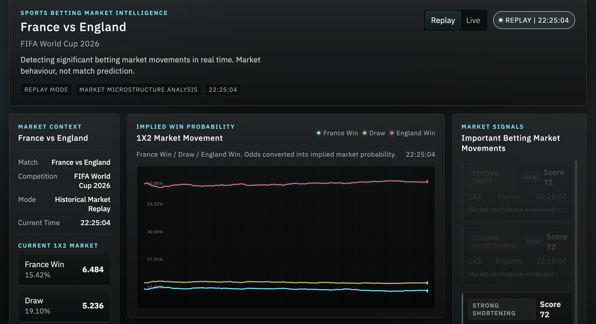
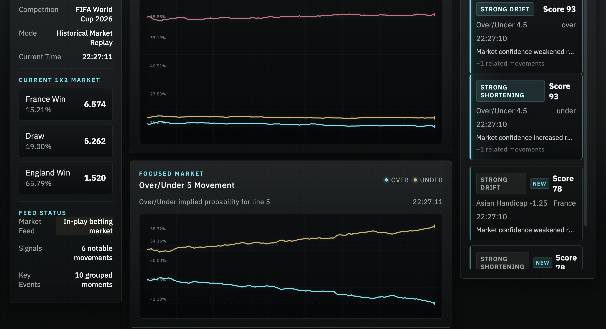
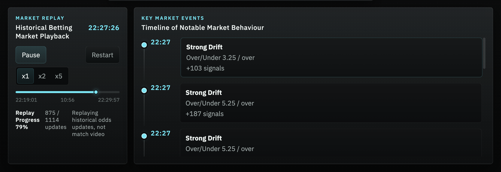

# Sports Betting Market Intelligence

Real-time sports betting market intelligence platform built for the **TxLINE World Cup Hackathon (Superteam Earn)**.

The platform transforms live betting odds into implied probabilities, detects significant market movements using a momentum-based signal engine, and visualizes betting market behaviour through an interactive replay dashboard.

---

## Hackathon

Built for:

**TxLINE World Cup Hackathon (Superteam Earn)**

---

## Screenshots

## Dashboard



## Signals



## Timeline



---

## Demo

🌐 Live Demo

https://sports-trading-signal-engine-delta.vercel.app/

💻 GitHub Repository

https://github.com/cjy8516/sports-trading-signal-engine

---

## Overview

Sports betting markets move continuously before and during matches.

Raw odds alone are difficult to interpret.

This project converts odds into implied market probabilities and detects important market behaviour such as:

- Strong Shortening
- Strong Drift
- Momentum Acceleration
- Persistent Market Movement

Instead of predicting match outcomes, the system highlights how betting markets evolve over time.

---

## Features

### Historical Replay

Replay historical betting market data as if it were live.

### Market Intelligence Dashboard

Visualize implied probability changes across multiple betting markets.

### Signal Engine

Automatically detects significant market movements using:

- Velocity
- Acceleration
- Persistence

Signals are scored and classified into:

- Strong Shortening
- Shortening
- Drift
- Strong Drift

### Interactive Timeline

Replay key betting market events with grouped signal summaries.

### Multi-market Support

- 1X2
- Asian Handicap
- Over / Under

---

## Architecture

```
             TxLINE Replay Dataset
                     │
                     ▼
              FastAPI Backend
                     │
        Signal Engine & Repository
                     │
                     ▼
             REST API Endpoints
                     │
                     ▼
           React + Vite Dashboard
```

---

## Technology Stack

### Backend

- Python
- FastAPI

### Frontend

- React
- Vite

### Data

- TxLINE Replay Data

### Deployment

- Render
- Vercel

---

## Project Structure

```
api/
config/
dashboard/
domain/
engine/
ingestion/
storage/
tests/
data/
```

---

## Running Locally

Backend

```bash
pip install -r requirements.txt

uvicorn api.app:app --reload
```

Frontend

```bash
cd dashboard

npm install

npm run dev
```

---

## Future Work

- Live TxLINE streaming integration
- WebSocket updates
- Additional betting markets
- Market anomaly alerts
- Strategy backtesting
